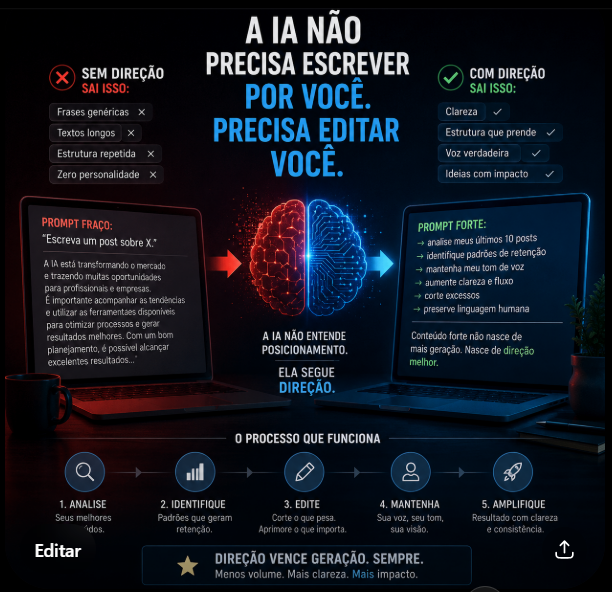

# IA para Conteúdo Estratégico

## Sobre o projeto
Este projeto demonstra como a Inteligência Artificial pode ser utilizada não apenas para gerar conteúdo, mas para analisar padrões, melhorar clareza e aumentar retenção em publicações profissionais.

A proposta central é:

> IA não substitui direção estratégica. Ela potencializa clareza, estrutura e impacto.

---

## Objetivos
- Melhorar retenção em posts
- Reduzir excesso de texto
- Aumentar clareza da comunicação
- Manter autenticidade e voz própria
- Estruturar conteúdos com maior engajamento

---

## Tecnologias e Conceitos
- Inteligência Artificial
- Engenharia de Prompt
- Copywriting
- Comunicação Estratégica
- LinkedIn Analytics
- Data Analytics

---

## Processo Utilizado

### 1. Análise de Conteúdo
A IA analisa:
- posts anteriores
- padrões de retenção
- estrutura textual
- clareza

### 2. Refinamento
A IA é utilizada para:
- remover excesso
- melhorar fluxo
- otimizar impacto
- aumentar objetividade

### 3. Resultado
Conteúdos:
- mais claros
- mais estratégicos
- menos genéricos
- mais humanos

---

## Insight Principal
> “Conteúdo forte não nasce de mais geração. Nasce de direção melhor.”

---

## Preview

---

## Autor
Marcos Feitosa  
Analista de Dados | Power BI • SQL • Python • Excel
